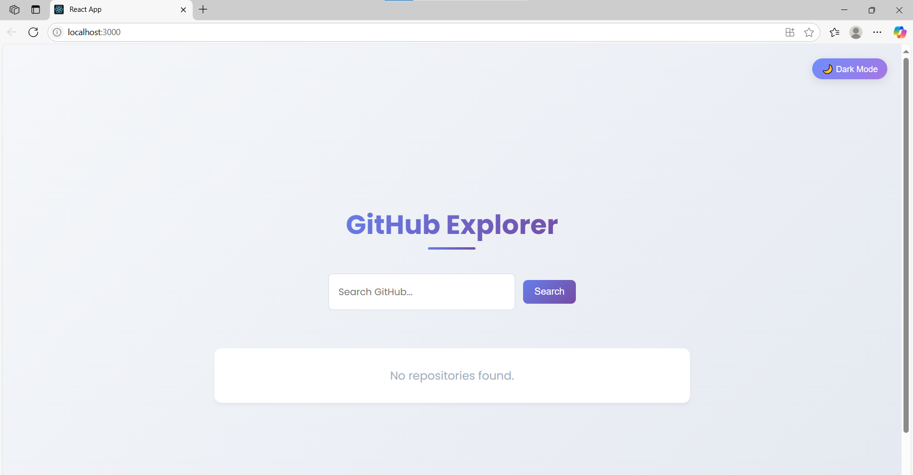
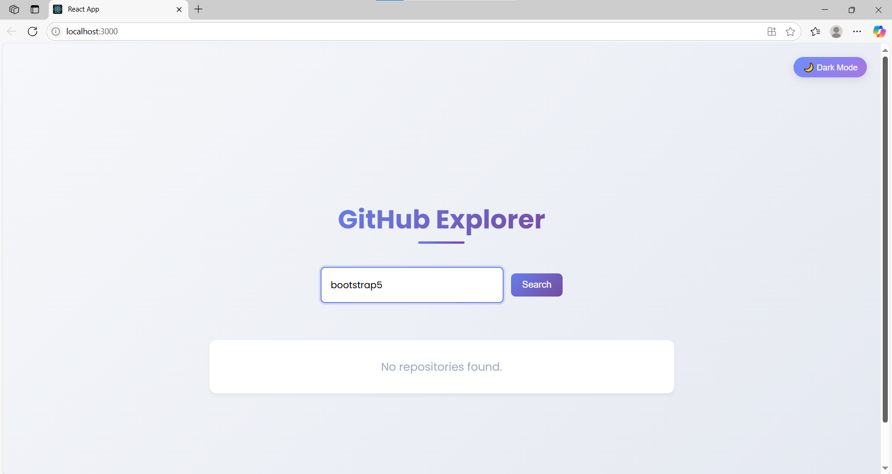
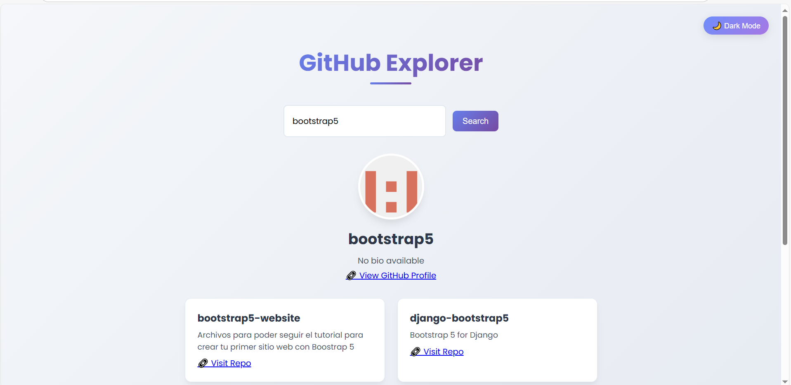
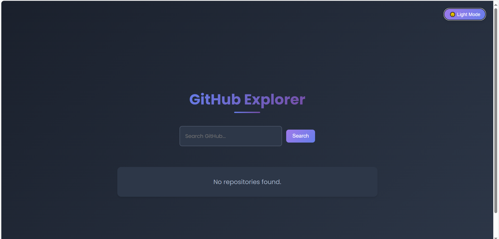
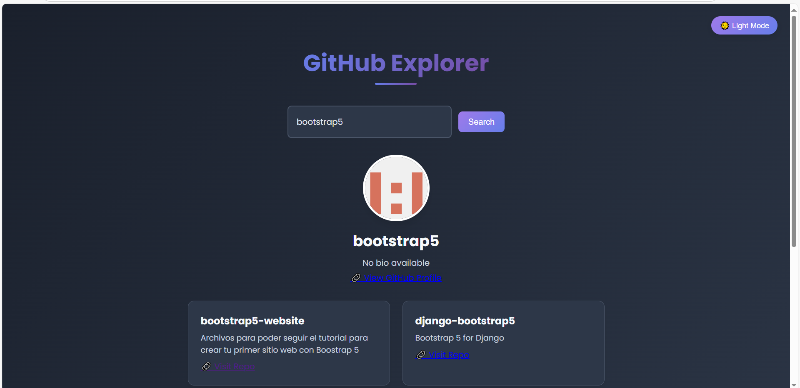

# 🚀 GitHub Explorer

A modern and interactive web application to explore GitHub repositories and user profiles, built using **React.js** and the **GitHub API**. 
Live Project Link: https://github-explorer-omega-ten.vercel.app/
---

## 📌 Project Overview

**GitHub Explorer** allows users to:

- Search GitHub repositories by keywords.
- View repository details (stars, forks, language, etc.).
- View GitHub user profile data.
- Paginate results.
- Switch between light mode and dark mode.
- Enjoy a responsive, animated, and stylish UI with gradient backgrounds.

---

## 🖼️ Screenshots
##Lightmode





##Darkmode




---

## ⚙️ How to Run the Project Locally

### 🔧 Prerequisites

- Node.js and npm installed
- Internet connection (for GitHub API access)

### 📦 Steps to Run

1. **Clone the Repository**

```bash
git clone https://github.com/gauravbhuravane/github-explorer.git
cd github-explorer

2. **Install Dependencies**
npm install

3. **Start the App**
npm start

4. **View in Browser**
Open http://localhost:3000 in your browser.

💡 Features Summary
🔍 Repository Search

👤 User Profile Display

📄 Pagination for Repositories

🌙 Dark/Light Mode Toggle (top-right corner)

🎨 Attractive UI with gradient backgrounds

📱 Mobile responsive design

💫 Smooth fade-in animations

🛠️ Technologies Used
React.js – Frontend framework

HTML & CSS – Layout and design

JavaScript – Application logic

GitHub API – Data source

Responsive Design – Media queries and flexbox/grid

📈 Future Enhancements (Optional Ideas)
Infinite scrolling instead of pagination

Add filters by language/stars

Show list of user's starred repositories

Add loader/spinner during API calls


👨‍💻 Author
Gaurav Bhuravane
📍 Sangameshwar, India
📧 bhuravanegaurav123@gmail.com


